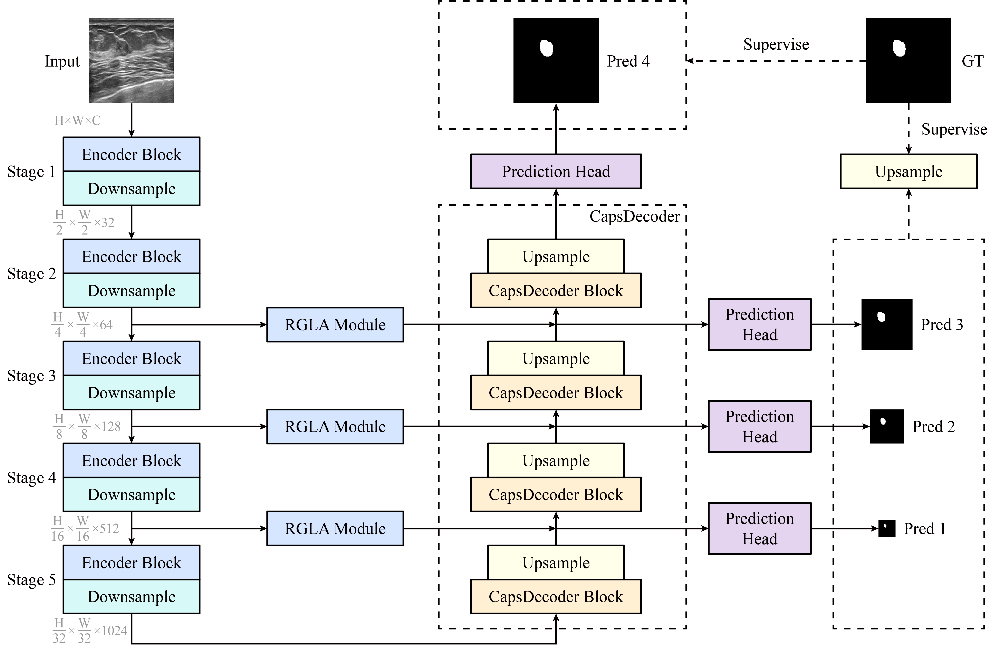

# <p align=center>Integrality Capsule Learning Network for Breast Lesion Segmentation in Ultrasound Images</p>

<p align=center>Le Gu, Yuchen Yan, Bo Jiang, Yuhe Ding, Zhengzheng Tu, and Chaoxue Zhang</p>

## Introduction
This repository is the official implementation for "Integrality Capsule Learning Network for Breast Lesion Segmentation in Ultrasound Images".



## Abstract
Convolutional neural networks (CNNs) have shown substantial promise in medical image segmentation, but current methods often struggle with accurately delineating lesion regions, leading to incomplete boundaries or missed interior areas. To address these limitations, we propose a novel model, Integrality Capsule Learning Network (ICLNet), designed specifically for the segmentation of breast lesions in ultrasound (BUS) images. ICLNet introduces two key innovations. First, we replace traditional skip connections in U-Net with a Residual Global Local Attention (RGLA) module, which enhances both global and local feature representation while preserving the original image features, thereby improving segmentation integrity. Second, inspired by capsule networks, we design a novel CapsDecoder decoder, leveraging the capability of capsules to capture both local and global object features, further improving segmentation accuracy. Experimental results on the AMUBUS and BUSI datasets demonstrate that ICLNet outperforms existing state-of-the-art methods for medical image segmentation. Our code is available at https://github.com/bscs12/ICLNet.

## Getting Started
### Prepare Environment
1. Clone repository
```
git clone https://github.com/bscs12/ICLNet.git
cd ICLNet
```

2. Create environment
```
conda create -n ICLNet python=3.8
conda activate ICLNet
```

3. Install PyTorch

```
pip install torch==1.10.0+cu113 torchvision==0.11.0+cu113 torchaudio==0.10.0 --extra-index-url https://download.pytorch.org/whl/cu113
```
or
```
conda install pytorch==1.10.0 torchvision==0.11.0 torchaudio==0.10.0 cudatoolkit=11.3 -c pytorch -c conda-forge
```

4. Install APEX
```
git clone https://github.com/NVIDIA/apex
cd apex
pip install -v --disable-pip-version-check --no-cache-dir ./
```

5. Install other pakages if needed

### Prepare Checkpoint
You can download the pretrained weight of backbone from [https://pan.baidu.com/s/1JPdYgxUePwYeFR_hRlcpTg?pwd=s7qt] [Password: ```s7qt```].

### Prepare Dataset

1. Download dataset

You can download the AMUBUS dataset and BUSI dataset from [https://pan.baidu.com/s/1JPdYgxUePwYeFR_hRlcpTg?pwd=s7qt] [Password: ```s7qt```].

2. Prepare your own dataset

Make sure the dataset folder structure like this:

You can use ```utils/generate_txt.py``` to generate the ```train.txt``` and ```test.txt```.
```
datasets
    ├── AMUBUS
    │   ├── Train
    │   │   ├── Image
    │   │   │   ├── xxx.png
    │   │   │   ├── xxx.png
    │   │   │   ├── ...
    │   │   ├── GT
    │   │   │   ├── xxx.png
    │   │   │   ├── xxx.png
    │   │   │   ├── ...
    │   │   └── train.txt
    │   └── Test
    │       ├── Image
    │       │   ├── xxx.png
    │       │   ├── xxx.png
    │       │   ├── ...
    │       ├── GT
    │       └── test.txt
    ├── BUSI
    │   ├── Train
    │   │   ├── Image
    │   │   │   ├── xxx.png
    │   │   │   ├── xxx.png
    │   │   │   ├── ...
    │   │   ├── GT
    │   │   │   ├── xxx.png
    │   │   │   ├── xxx.png
    │   │   │   ├── ...
    │   │   └── train.txt
    │   └── Test
    │       ├── Image
    │       │   ├── xxx.png
    │       │   ├── xxx.png
    │       │   ├── ...
    │       ├── GT
    │       └── test.txt
    ├── ...
```
### Train
```
python train.py
```
### Test
```
python test.py
```
## Cite
If you find this work useful for your, please consider citing our paper. Thank you!
